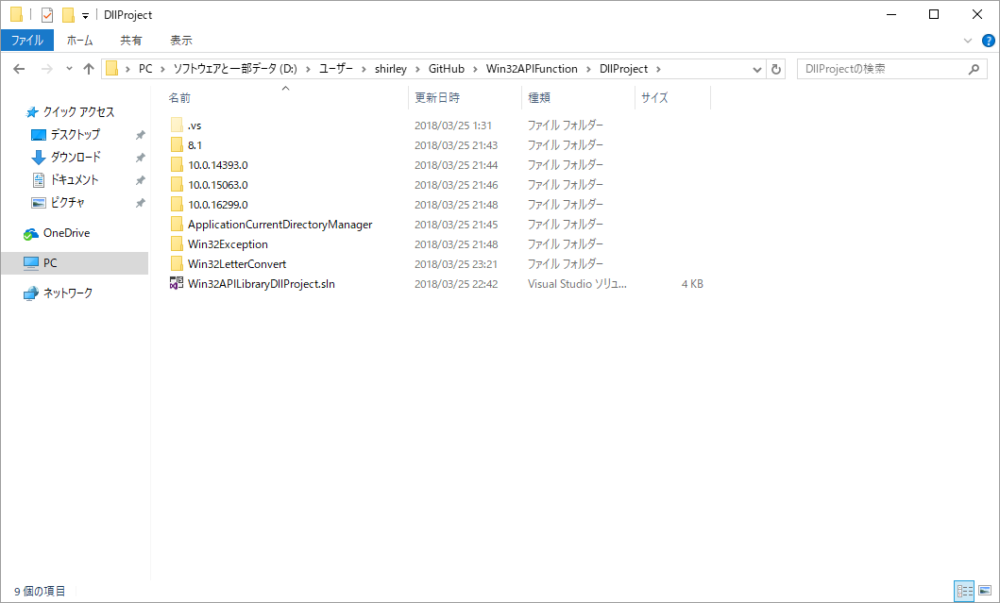
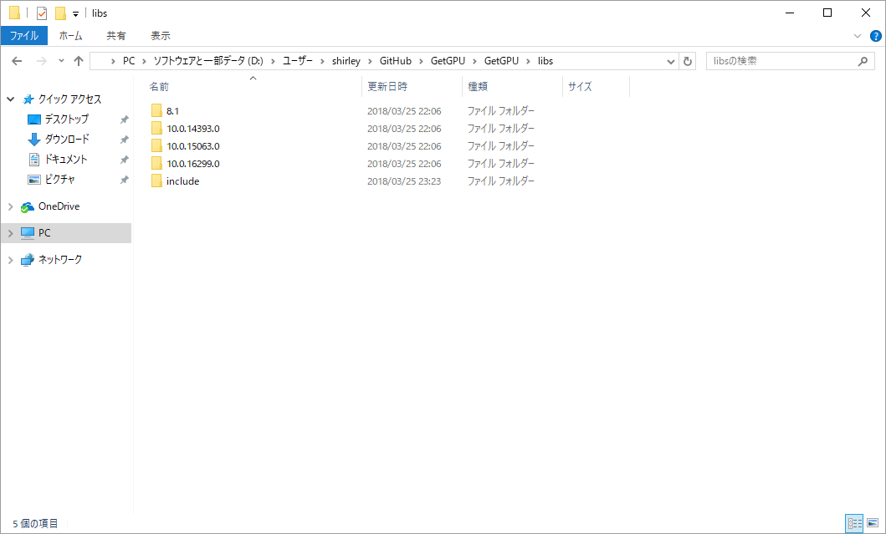

# GetGPU
DirectX 11と12を利用した、コンピュータにあるGPUの一覧を表示するプログラム

## プロジェクトの使い方
このリポジトリには、ChooseGPUというC#のプロジェクトが一緒にあります。

これは、GetGPUのExeVersionまたはRundll32ExecuteDllTypeのどちらかを使用して作成したgpu.xmlを読み込み、実際にGUIでユーザーにGPUを選択させるものです。

このGUIをご自身で好きなように作り、GPUの一覧(型：List<GPUInformation>)のデータを表示させてください。表示の仕方、選択のさせ方等についてもご自由にどうぞ。

## ビルド方法
### 共通
[あいめぐさんが作ったこちらのライブラリ](https://github.com/AinoMegumi/Win32APIFunction)をビルドすると、このようになるので

そのままビルド生成物が入ったフォルダを中の構成を変えずに以下のようにすることでビルド可能になります。

配布時は対応したdllを一緒に配布してください。

※StaticProjectでもできますが、その場合はプロジェクト設定を少し変更する必要があります。

### DirectX 11を使用しての判定をしたい場合
プロジェクトのプロパティからWindows SDKバージョンを「8.1」に変更してビルドしてください。

### DirectX 12を使用しての判定をしたい場合
プロジェクトのプロパティからWindows SDKバージョンを「10」のいずれかに変更してビルドしてください。

## ビルドしたものの使い方
### ExeVersion
GetGPU.exe &lt;xmlを出力するパス&gt;
### Rundll32ExecuteDllType
rundll32.exe GetGPUDll.dll,GetGPUInformation &lt;xmlを出力するパス&gt;

## サポートＯＳ

- Windows 7
- Windows 8.1
- Windows 10 Anniversary Update以降(Windows 10 SDKによるビルド)

※Microsoftによってサポートが切れたＯＳについては、更新の遅延等でここに記述があったとしてもサポートを切っておりますので予めご了承下さい。

## ライセンスについて

ソースコードによってライセンスが異なります。

### Main.cpp内のコード及びChooseGPUプロジェクトのソースコード
このソースコードは、(GNU General Public License(GPL))ライセンスとなっています。

### MSXMLWriteクラスのソースコード(MSXMLWrite.cpp、MSXMLWrite.hpp)
現在このソースコードは別途公開準備中ですが、MITライセンスとなっています。

### あいめぐさんのライブラリ
Copyright (c) 2018 あいめぐ

Released under the MIT license

[https://github.com/AinoMegumi/Win32APIFunction/blob/master/LICENSE](https://github.com/AinoMegumi/Win32APIFunction/blob/master/LICENSE)
